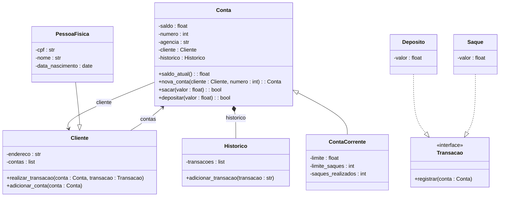

# Sistema Bancário - SYS_BANKV3

## Descrição do Projeto

O projeto SYS_BANKV3 é uma aplicação de terminal escrita em Python que simula operações básicas de um sistema bancário com suporte a múltiplos clientes, contas, depósitos, saques e histórico de transações.

Durante sua construção, aplicamos diversos conceitos de Programação Orientada a Objetos (POO), como:

- Classe abstrata e método abstrato, com a classe `Transacao`.
- Herança e polimorfismo, com `Cliente` e `PessoaFisica`, `Conta` e `ContaCorrente`.
- Encapsulamento, para proteger o saldo das contas e registrar todas as operações com responsabilidade.

Essa experiência proporcionou um excelente exercício de design de software, onde a arquitetura e responsabilidade de cada classe foram pensadas cuidadosamente para manter a coesão e reutilização de código.

## Estrutura UML 

---------------

------------------

## Explicação da Arquitetura

### 1. Transacao (Classe Abstrata)
Define a estrutura base para qualquer transação no sistema. Seus métodos são implementados por `Saque` e `Deposito`, que concretizam as regras de negócio.

### 2. Historico
Responsável por armazenar uma lista de todas as operações realizadas na conta. Cada conta possui seu próprio histórico.

### 3. Conta e ContaCorrente
A `Conta` representa uma conta bancária genérica. Já a `ContaCorrente` estende `Conta` com limites específicos para saques e quantidade de saques permitidos. Isso mostra herança com especialização.

### 4. Cliente e PessoaFisica
`Cliente` é uma classe base para qualquer tipo de cliente. A `PessoaFisica` representa clientes reais e adiciona dados como CPF, nome e data de nascimento.

### 5. Métodos de Classe e Polimorfismo
A criação da conta é feita com o método de classe `nova_conta`, que permite instanciar objetos de forma controlada. Além disso, o método `sacar()` é sobrescrito na classe `ContaCorrente`, mostrando polimorfismo por sobrescrita.

## Conclusão

Este projeto foi uma rica experiência na modelagem de um sistema orientado a objetos. Cada classe possui uma única responsabilidade, o que facilita manutenções e ampliações futuras, como adição de novos tipos de contas, clientes ou até integração com banco de dados.

Foi uma ótima oportunidade para aplicar:

- Boas práticas de POO
- Design orientado a domínio
- Abstração e especialização realista
